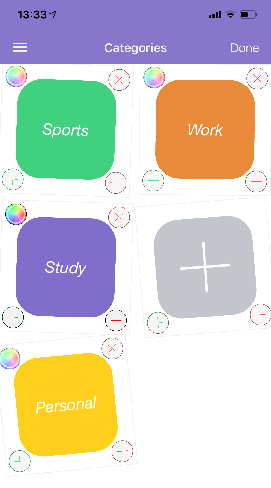
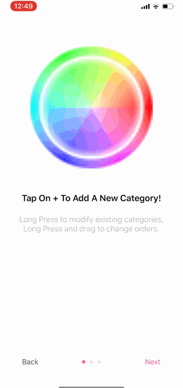
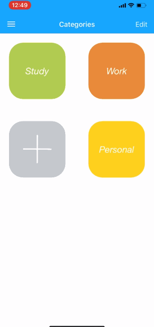
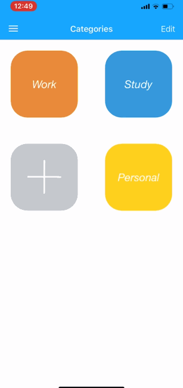
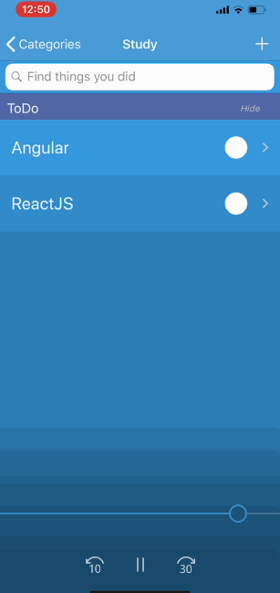
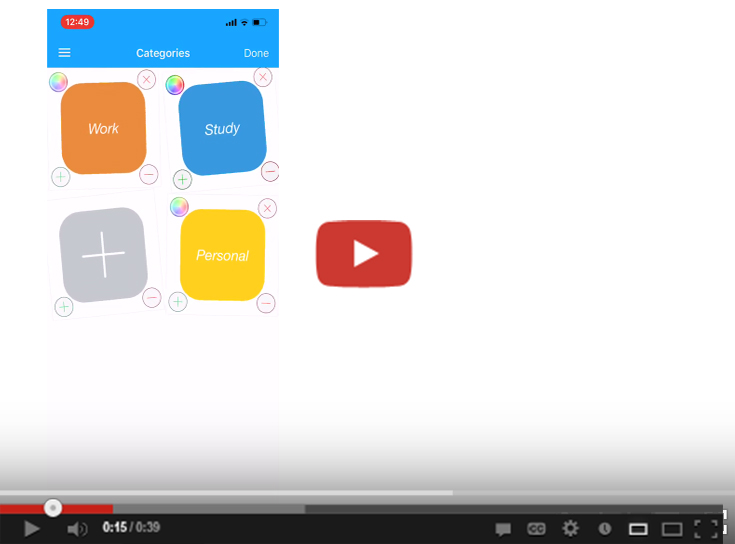

<h1></h1>

  

<h1></h1>
<h6 align="center"> This project is aimed to be a diary-like app, recording your daily achievements. </h6>

<h1></h1>

# ToDo + Note
An iOS app combined to-do list and note taking functions, available on iPhone and iPad.  
Created with Swift 5.0 and Xcode 10.

> Note taking function is active now, but uploading image feature is still under construction.

## First Time Run Turtorial
  
> Images are currently placeholders and will be replaced when deploy.  
> You can later view tutorial in the menu too.

## Customize Your Categories
  
> Long press to move around, change size and color, or delete a category.

## Tap "+" to Add
  
> Tap on "+" to create new category and ToDo item.

## Organize Your ToDos
  
> Change ToDo item state between todo, done, failed  
> Change theme color  
> Rearrange order  
> Hide / show tabs  

## Built With
* IDE - *Xcode 10*
* Database - *Core Data & SQLite*
* Language - *Swift 5.0*

## Author
* **DongMing Hu** - [hdmdhr](https://github.com/hdmdhr)

# View on Youtube   

